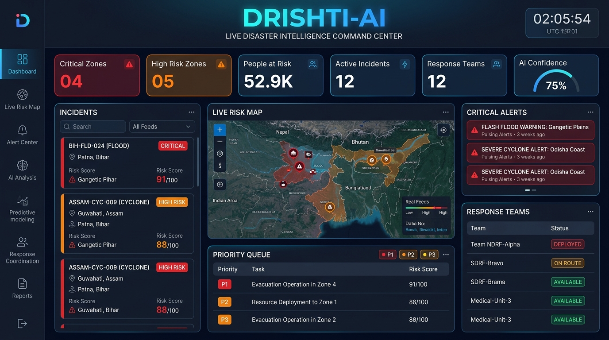
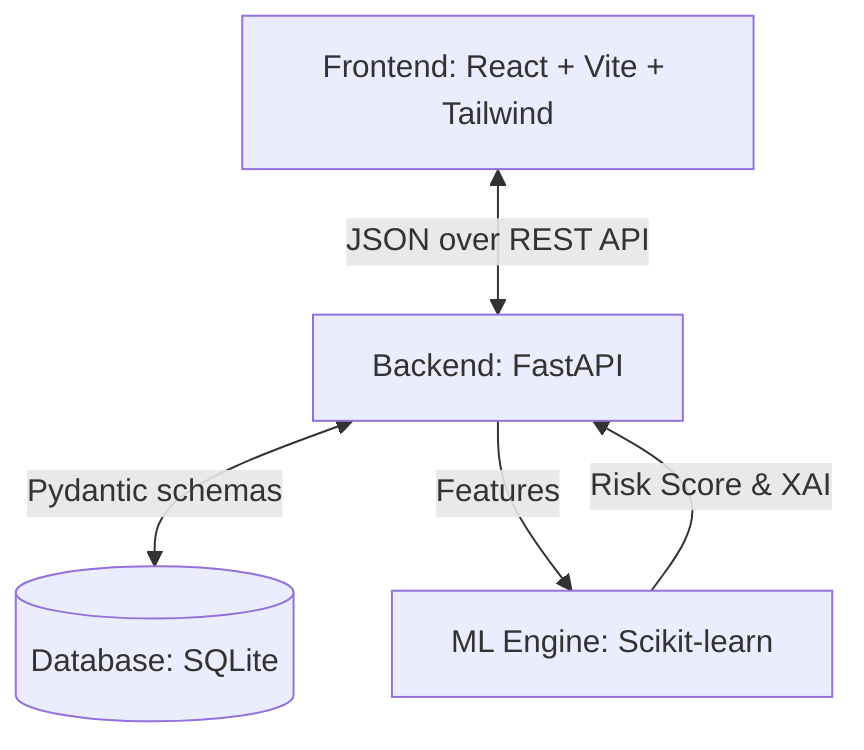
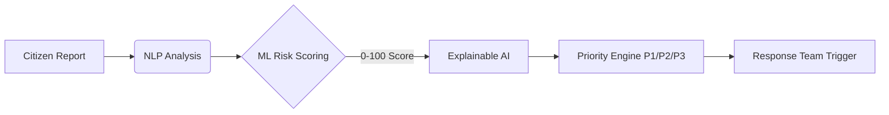

# DRISHTI-AI
## Disaster Risk Intelligence & Safety Tracking Hub



> **"See the Risk. Predict the Threat. Save Lives."**

A production-quality AI/ML-powered disaster intelligence and emergency response platform built for **Smart India Hackathon (SIH) 2024**.

---

## 🌐 Live Demo & Deployment

- **Frontend (Live Website):** [Insert Vercel Link Here]
- **Backend API Docs:** [Insert Render Link Here]/api/docs

*(Note: Replace the links above with your actual Vercel and Render links once deployed)*

---

## 🚀 Quick Start (One Command)

```bash
# Clone / navigate to project directory
cd "DRISHTI AI"

# Make startup script executable
chmod +x start.sh

# Start everything (trains ML model + starts backend + frontend)
./start.sh
```

Then open: **http://localhost:5173**

---

## 📋 Prerequisites

- **Python 3.9+** (tested on 3.13)
- **Node.js 18+**
- **pip** (Anaconda or system Python)

---

## 🔧 Manual Installation & Running

### 1. Backend (FastAPI + ML)

```bash
# Install Python dependencies
pip install fastapi "uvicorn[standard]" pydantic sqlalchemy aiosqlite \
  python-multipart scikit-learn pandas numpy joblib python-dotenv httpx

# Train ML models (first time only — takes ~30 seconds)
python ml/train.py

# Start backend server
cd backend
uvicorn app.main:app --host 0.0.0.0 --port 8000 --reload
```

Backend runs at: **http://localhost:8000**  
API Documentation: **http://localhost:8000/api/docs**

### 2. Frontend (React + Vite)

```bash
cd frontend
npm install --legacy-peer-deps
npm run dev
```

Frontend runs at: **http://localhost:5173**

### 3. ML Model Only (Re-train)

```bash
python ml/train.py
```

---

## 🔐 Environment Variables

Copy `.env.example` to `.env` in the backend directory:

```bash
cp .env.example backend/.env
```

| Variable | Default | Description |
|----------|---------|-------------|
| `DATABASE_URL` | `sqlite:///./drishti.db` | SQLite DB path |
| `ENVIRONMENT` | `development` | App environment |
| `SECRET_KEY` | `drishti-ai-sih-2024-secret-key` | JWT secret |
| `CORS_ORIGINS` | `http://localhost:5173` | Allowed origins |
| `UPLOAD_DIR` | `./uploads` | Image upload directory |

---

## 🔑 Demo Credentials

Authentication is **optional** for the MVP. Just click "ENTER COMMAND CENTER" on the landing page.

If authentication is added in future:
- **Username:** `admin`
- **Password:** `drishti2024`

---

## 🏗️ Architecture



### Data Flow



---

## 📡 API Endpoints

| Method | Endpoint | Description |
|--------|----------|-------------|
| GET | `/api/incidents` | List all incidents |
| GET | `/api/incidents/{id}` | Get incident by ID |
| POST | `/api/incidents` | Create new incident |
| POST | `/api/analyze-incident` | AI/NLP text analysis |
| POST | `/api/calculate-risk` | Calculate risk score |
| POST | `/api/what-if` | What-If simulation |
| POST | `/api/citizen-report` | Submit citizen report |
| GET | `/api/alerts` | Get alerts |
| GET | `/api/response-teams` | Get response teams |
| GET | `/api/analytics` | Analytics data |
| POST | `/api/chat` | AI assistant chat |
| GET | `/api/docs` | Swagger API documentation |

---

## 🗂️ Project Structure

```
DRISHTI AI/
│
├── frontend/                      # React + Vite + Tailwind
│   ├── src/
│   │   ├── components/            # Layout, DrishtiAssistant, SharedComponents
│   │   ├── pages/                 # Dashboard, MapPage, Analytics, etc.
│   │   ├── services/              # Axios API service layer
│   │   ├── hooks/                 # useDemoMode
│   │   └── utils/                 # helpers.js
│   ├── package.json
│   ├── vite.config.js
│   └── tailwind.config.js
│
├── backend/                       # FastAPI Python backend
│   ├── app/
│   │   ├── main.py               # FastAPI app entry point
│   │   ├── models/               # SQLAlchemy models
│   │   ├── schemas/              # Pydantic schemas
│   │   ├── routes/               # API routers
│   │   └── database/             # DB setup + seed data
│   └── requirements.txt
│
├── ml/                            # ML/AI layer
│   ├── dataset_generator.py      # Synthetic training data
│   ├── train.py                  # Model training
│   ├── predict.py                # Prediction + NLP engine
│   └── models/                   # Saved model files (joblib)
│
├── .env.example                  # Environment variables template
├── docker-compose.yml            # Docker deployment
├── start.sh                      # One-command startup
└── README.md
```

---

## 🌟 Key Features

### 1. AI Command Center Dashboard
- Animated stats: Critical Zones, High Risk Zones, People at Risk, Active Incidents
- Live demo runner (10-step Bihar flood scenario)
- Priority response queue with P1/P2/P3 triage

### 2. Live India Risk Map (Leaflet)
- Color-coded markers: 🔴 CRITICAL, 🟠 HIGH, 🟡 MEDIUM, 🟢 LOW
- Clickable incident detail panel
- Disaster type + severity filters
- Dark CartoDB basemap

### 3. ML Risk Scoring
- RandomForestClassifier for risk category (LOW/MEDIUM/HIGH/CRITICAL)
- GradientBoostingRegressor for exact 0-100 risk score
- Features: rainfall, river_level, population_density, affected_population, etc.
- Trained on 5,000 synthetic Indian disaster scenarios

### 4. Explainable AI (XAI)
- Feature contribution visualization for each incident
- "Why is this high risk?" breakdown
- Natural language AI explanation
- Total risk attribution bars

### 5. AI/NLP Incident Analysis
- Free-text incident description → hazard classification
- Keyword-based NLP with ML fallback
- Population extraction via regex
- Urgency and severity detection

### 6. What-If Disaster Simulator
- Real-time slider-driven risk recalculation
- Preset scenarios (Bihar Flood, Odisha Cyclone, etc.)
- Risk category transitions with animation
- People at risk estimation

### 7. Citizen Reporting
- Form with disaster type, description, location, GPS, image upload
- AI auto-analysis on submission
- Duplicate detection & clustering
- Report ID + AI classification result display

### 8. DRISHTI Intelligence Chat
- Floating AI assistant widget
- Context-aware responses using live incident data
- Quick prompts for common queries

### 9. Alert Center
- Pulsing critical alerts
- Risk escalation tracking (old → new score)
- Acknowledge functionality

### 10. Response Teams
- NDRF/SDRF/Medical/Fire/Police/Volunteer teams
- Status: AVAILABLE/DEPLOYED/BUSY
- Team assignments and ETAs

### 11. Analytics (Recharts)
- Risk trend over time (area chart)
- Incidents by type (pie chart)
- Critical incidents by state (bar chart)
- Incident types over time (stacked bar)
- Day filter: Today / 7 Days / 30 Days

---

## ⚠️ Important Disclaimers

1. **Demo/Synthetic Data**: All incident data, risk scores, and predictions are synthetic. No real government systems are connected.

2. **AI Disclaimer**: DRISHTI-AI is a decision-support prototype. Risk predictions are AI-generated and should be validated by authorized emergency-management personnel before real-world deployment.

3. **Response Teams**: Teams shown are demo units — not affiliated with real NDRF, SDRF, or government emergency services.

4. **Not for Emergency Use**: Do not use this for actual emergency reporting. Call 112 for real emergencies.

---

## 🤖 ML Model Details

| Model | Type | Accuracy |
|-------|------|----------|
| Risk Classifier | RandomForest (150 trees) | ~95% CV accuracy |
| Risk Regressor | GradientBoosting (200 estimators) | R² ~0.98 |

**Training Data**: 5,000 synthetic samples generated with realistic Indian disaster statistics.

**Features Used**:
- `rainfall` — Rainfall intensity (0-100)
- `river_level` — River water level (0-100)
- `population_density` — Population density (0-100)
- `affected_population` — Number of people affected
- `historical_disaster_freq` — Historical disaster frequency
- `infrastructure_vulnerability` — Infrastructure vulnerability score
- `weather_severity` — Weather severity index
- `distance_to_hospital` — Distance to nearest hospital
- `road_accessibility` — Road accessibility score

---

## 📦 Tech Stack

| Layer | Technology |
|-------|-----------|
| Frontend | React 18, Vite 5, Tailwind CSS 3 |
| Maps | Leaflet + React-Leaflet |
| Charts | Recharts |
| Animations | Framer Motion |
| Icons | Lucide React |
| HTTP Client | Axios |
| Backend | FastAPI, Python 3.13 |
| ORM | SQLAlchemy 2.x |
| Database | SQLite (PostgreSQL-ready) |
| ML | scikit-learn, pandas, numpy |
| NLP | Rule-based + ML hybrid |

---

## 🏆 SIH Presentation Guide

1. Start with **RUN LIVE DEMO** button on Dashboard
2. Show the **10-step Bihar flood scenario**
3. Click the Bihar incident on the **Map** to show XAI panel
4. Use **AI Analysis** page to analyze a sample text
5. Demo the **What-If Simulator** — drag rainfall to CRITICAL
6. Show **Alert Center** with pulsing alerts
7. Open **DRISHTI Intelligence** chat widget

**Total demo time: 3-5 minutes**

---

*Built with ❤️ for Smart India Hackathon 2024*
